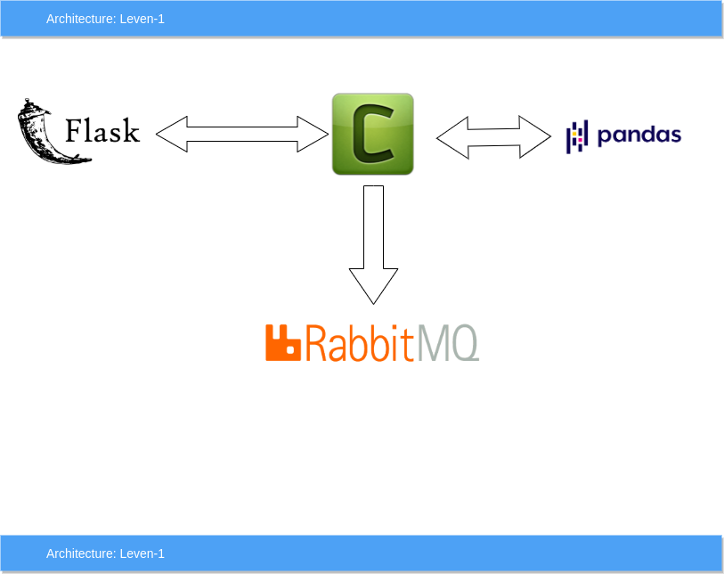
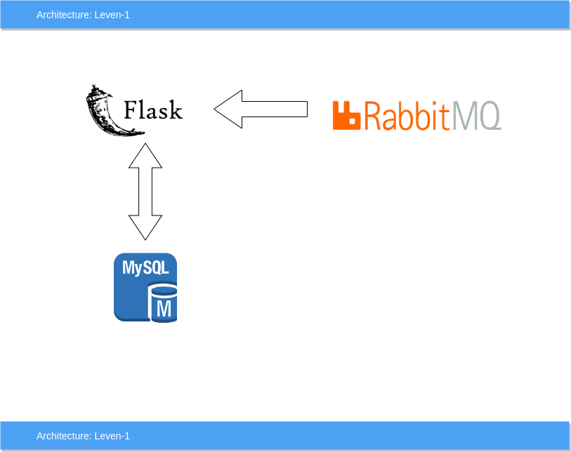

# csv with queue
Process the csv file with multiple server 
### Requirement:
* Python
* Flask
* RabbitMQ
* Celery
* MySQL
* Swagger
* docker
#### Folder Structure:
    --consumer(consumer)
      --api
        --model(Database model)
        --service(business ligic)
        --utility(utility stuff)
        --__init__.py
        --file(routing with controller)
        --portfolio(routing with controller)
      --static
      --test
      --run.py(main file to run application)
    --development(publisher)
      --api
        --model(Database model)
        --service(business ligic)
        --utility(utility stuff)
        --__init__.py
        --file(routing with controller)
        --portfolio(routing with controller)
      --static
      --test
      --run.py(main file to run application)
    --mysql(For database)
    --mysql_dumps( to keep baackup of database)
    --nginx
    --rabbit(rabbitMQ)
    --traefik.toml(to monitor the trafic with list of url)
    
### Architecture:
#### Publisher

#### Consumer

#### Step-1
1. Install Docker 
2. git clone https://github.com/sbsanjaybharti/csv_with_queue
3. Open the terminal in the folder and run the command<br/>
    ````
    >>> docker-compose build
    >>> docker-compose up

#### Step-2
1. open the link http://localhost:8080/ here you will get the link url like app, database, queue.
2. You can use the url provided or IP link in right, 
3. For publisher click on http://dev.docker.localhost/ two upload the CSV file
4. For consumer click on http://consumer.docker.localhost/ and click on start server api then list api


#### Step-3 Database setup
1. Open the link http://phpmyadmin.docker.localhost
2. Username: root, password: root
3. create database fincompare
4. on the terminal follow the command
5. docker-compose exec consumer /bin/bash
6. python run.py db init
7. python run.py db migrate
8. python run.py db upgrade

#### Step-4 Check RabbitMQ
1. Open the url http://rabbit.docker.localhost/
2. Create Exchange" csv-exchange, Routing key: csv-routing-key, Queue; csv-queue
3. Now you can run the application

##### Feature:
1. Celery is used to sending data to queue so that working can divide to multiple worker or server
2. Panda library is used  to handle big data to process CSV.
3. Swagger to display the API.
4. Application can handle large number of data without user waiting time. 
